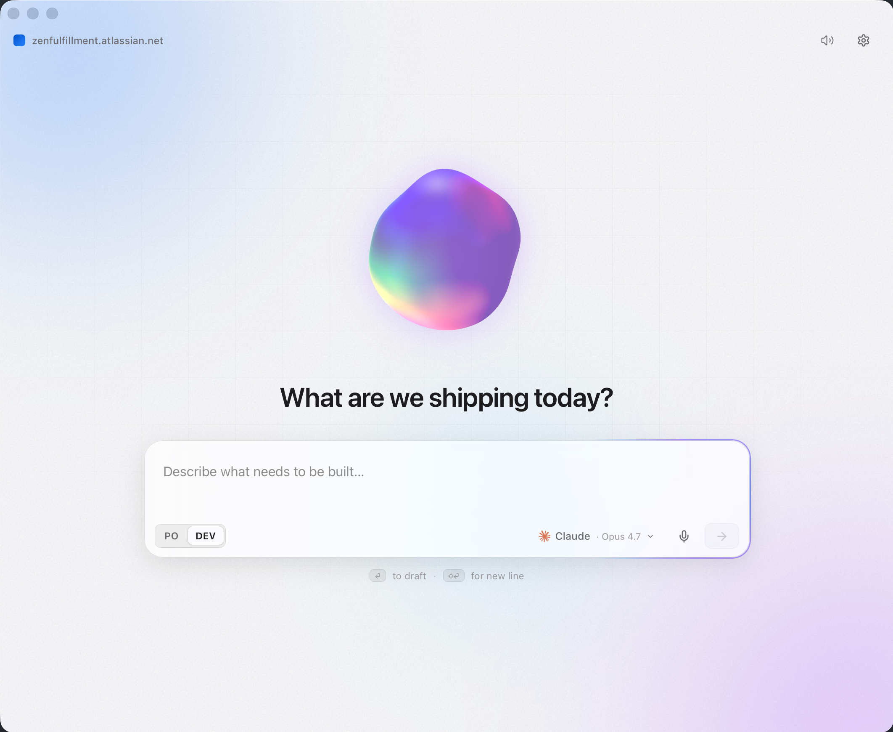
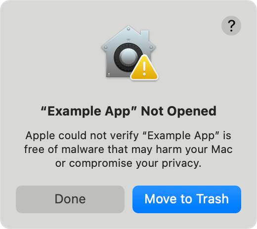
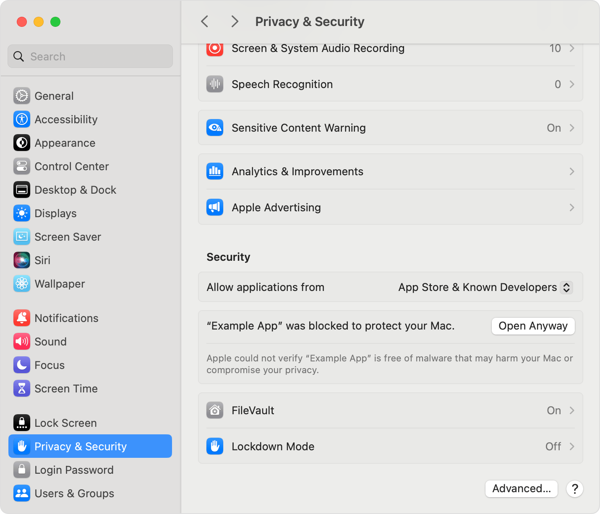

<div align="center">

# Zenful Tickets

**An AI first Jira ticket drafter for your desktop.**

Describe what needs to be built. Get a complete, editable Jira draft with title, type, priority, labels, body, and subtasks.
From idea to action items in seconds.

[](https://v2.tauri.app/)
[](https://react.dev/)
[](https://www.typescriptlang.org/)
[](https://www.rust-lang.org/)
[](#installation)
[](#license)
[](https://github.com/zenfulfillment/zenful-tickets/releases)

<br />



<br />
<br />

### Download the latest release

<p>
  <a href="https://github.com/zenfulfillment/zenful-tickets/releases/latest/download/Zenful-Tickets-macOS-universal.dmg">
    
  </a>
  <a href="https://github.com/zenfulfillment/zenful-tickets/releases/latest/download/Zenful-Tickets-Windows-x64-setup.exe">
    
  </a>
  <a href="https://github.com/zenfulfillment/zenful-tickets/releases/latest/download/Zenful-Tickets-Linux-x64.AppImage">
    
  </a>
</p>

<sub>Or browse <a href="https://github.com/zenfulfillment/zenful-tickets/releases/latest">all assets on the latest release page</a> (`.msi`, `.deb`, `.tar.gz`, signatures).</sub>

</div>

---

## Table of Contents

- [Zenful Tickets](#zenful-tickets)
    - [Download the latest release](#download-the-latest-release)
  - [Table of Contents](#table-of-contents)
  - [Overview](#overview)
  - [Features](#features)
  - [Installation](#installation)
    - [Download a release](#download-a-release)
    - [Homebrew (macOS, planned)](#homebrew-macos-planned)
    - [From source](#from-source)
    - [macOS — first launch \& Gatekeeper](#macos--first-launch--gatekeeper)
      - [What you'll see](#what-youll-see)
      - [How to launch it — System Settings (macOS 13+, recommended)](#how-to-launch-it--system-settings-macos-13-recommended)
      - [Alternative — terminal (power users)](#alternative--terminal-power-users)
      - [Alternative — right-click → Open (older macOS only)](#alternative--right-click--open-older-macos-only)
      - [About auto-updates](#about-auto-updates)
      - [When will this go away?](#when-will-this-go-away)
  - [Quick Start](#quick-start)
  - [Configuration](#configuration)
  - [Architecture](#architecture)
    - [Capability model](#capability-model)
  - [Project Structure](#project-structure)
  - [Tech Stack](#tech-stack)
  - [Development](#development)
    - [Prerequisites](#prerequisites)
    - [Run the app](#run-the-app)
    - [Other useful commands](#other-useful-commands)
    - [Working with the design mockups](#working-with-the-design-mockups)
  - [Building From Source](#building-from-source)
  - [Releasing](#releasing)
  - [Security](#security)
  - [Contributing](#contributing)

## Overview

Zenful Tickets is a native desktop app that turns a one-line idea into a polished Jira ticket. Hit a global hotkey, type or speak what you want to build, and the app streams a complete draft back — in **PO** mode (story-shaped, business-readable) or **DEV** mode (technical, implementation-detailed). Edit inline, then create the ticket (and any subtasks) directly in your Jira workspace with one click.

It speaks to your existing AI tooling: the **Claude Code** and **Codex** CLIs you already have installed, plus **Gemini** via API. No vendor lock-in, no proxying your prompts through a third party — keys live in your OS keychain, requests go directly to the providers.

> **Status:** Early-stage, macOS-first. Linux and Windows builds are produced by CI but receive less manual testing.

## Features

- **One-prompt drafting** — describe a task in plain language, get back a Jira-ready ticket with title, body, type, priority, labels, and subtask breakdown.
- **Two drafting modes** — `PO` produces user-story-shaped tickets for product owners; `DEV` produces engineering-flavoured detail with acceptance criteria and tech notes.
- **Live streaming** — the body streams token-by-token; structured fields populate the moment the model emits them.
- **Multi-provider** — Anthropic (Claude Code CLI), OpenAI (Codex CLI), and Google (Gemini API). Pick a default; override per-draft from the model picker.
- **Voice input** — push-to-talk dictation powered by ElevenLabs Scribe v2 Realtime. Streams transcripts straight into the prompt box.
- **Global hotkey** — summon the window from anywhere with `⌘⌥T` (configurable).
- **Native Jira integration** — creates real issues via Jira REST v3 with proper ADF-formatted descriptions, attachments, and auto-created subtasks.
- **Auto-update** — signed updates delivered through the GitHub Releases pipeline, no app store required.
- **Secrets in the OS keychain** — Jira tokens and API keys are stored in macOS Keychain (or the OS-equivalent), never in plaintext.
- **Privacy-respecting telemetry** — none. The app talks only to Jira and the AI provider you choose.


## Installation

### Download a release

Pre-built binaries for macOS (universal), Linux (x64 AppImage), and Windows (x64 MSI/EXE) are published to the [Releases page](https://github.com/zenfulfillment/zenful-tickets/releases). The app self-updates from there.

### Homebrew (macOS, planned)

```bash
brew install --cask zenful-tickets   # coming soon
```

### From source

See [Building From Source](#building-from-source).

### macOS — first launch & Gatekeeper

> **TL;DR — the first time you open Zenful Tickets, macOS will refuse with a security warning. Open System Settings → Privacy & Security → click "Open Anyway". You only need to do this once.**

Zenful Tickets is currently distributed with **ad-hoc code signing**, not a paid Apple Developer ID. That means macOS Gatekeeper doesn't recognise the developer and will block the first launch. This is a normal step for OSS apps that aren't yet notarized, not a sign that something is wrong. (See Apple's own walkthrough: [Safely open apps on your Mac](https://support.apple.com/en-us/102445).)

#### What you'll see

When you double-click the app the first time, macOS shows a dialog like this:

<p align="center">
  
  <br />
  <sub><em>Source: <a href="https://support.apple.com/en-us/102445">support.apple.com/en-us/102445</a></em></sub>
</p>

> _"Zenful Tickets" Not Opened — Apple could not verify "Zenful Tickets" is free of malware that may harm your Mac or compromise your privacy._

Click **Done** — **don't** click *Move to Trash*.

#### How to launch it — System Settings (macOS 13+, recommended)

This is the path Apple now documents:

1. Open **System Settings → Privacy & Security**.
2. Scroll to the **Security** section. You'll see a line like:
   > _"Zenful Tickets" was blocked to protect your Mac._
3. Click **Open Anyway** next to it, then authenticate with Touch ID / your password.

<p align="center">
  
  <br />
  <sub><em>Source: <a href="https://support.apple.com/en-us/102445">support.apple.com/en-us/102445</a></em></sub>
</p>

4. The warning prompt reappears one last time with an **Open** button. Click it. macOS now remembers your choice — future launches don't prompt.

#### Alternative — terminal (power users)

```bash
xattr -d com.apple.quarantine "/Applications/Zenful Tickets.app"
open "/Applications/Zenful Tickets.app"
```

The first command strips the quarantine flag macOS attached on download; the second launches the app normally.

#### Alternative — right-click → Open (older macOS only)

On macOS **12 Monterey and earlier**, you can right-click `Zenful Tickets.app` in Finder → **Open**, then click **Open** in the resulting dialog. Apple deprecated this shortcut in macOS 15 Sequoia in favour of the System Settings flow above.

#### About auto-updates

The auto-updater is **separately signed** with our minisign key (independent of Apple's signature) and verifies the integrity of every update before installing it. After you've approved the app once via Privacy & Security, subsequent updates install silently — you don't repeat the Gatekeeper dance per release. (A major macOS version bump may occasionally re-trigger the check.)

#### When will this go away?

When the project moves to a paid **Apple Developer Program** membership and notarized builds, this section becomes irrelevant — the app will launch on first double-click like any other macOS app. Tracked in [`TODO.md`](./TODO.md).

> The same behaviour exists on **Windows** — SmartScreen will show "Windows protected your PC" on first launch. Click **More info → Run anyway**. Linux AppImages are unaffected.

## Quick Start

1. **Launch the app.** First run walks you through onboarding.
2. **Connect Jira.** Paste your Atlassian site (e.g. `acme.atlassian.net`), email, and an [Atlassian API token](https://id.atlassian.com/manage-profile/security/api-tokens). The app verifies the connection, then stores the token in your OS keychain.
3. **Pick an AI backend.**
    - **Claude** — install [Claude Code](https://claude.com/claude-code); the app detects it on `$PATH`.
    - **Codex** — install the [OpenAI Codex CLI](https://github.com/openai/codex); same detection.
    - **Gemini** — paste a [Google AI Studio key](https://aistudio.google.com/apikey).
4. **Draft a ticket.** Hit `⌘⌥T`, type or dictate what you need, press `↩` to draft. Edit inline. Click **Create**.

That's it. The created ticket URL is copied to your clipboard and (optionally) opened in your browser.

## Configuration

Everything user-facing lives in **Settings** (`⌘,`):

| Section | What's there |
| --- | --- |
| **General** | Theme (system / light / dark), reduced motion, sounds, launch at login, auto-update |
| **Jira** | Site, email, token (re-auth), default project, default issue type, auto-assign, open after create |
| **AI** | Per-provider enable, default provider, per-provider model variant, streaming on/off |
| **Drafting** | Default mode (PO/DEV), submit-on-Enter, tone (concise/balanced/detailed), custom system prompt |
| **Voice** | Enable, input device, silence threshold, auto-submit on silence |
| **Hotkeys** | Global summon combo |

Non-secret settings persist via [`tauri-plugin-store`](https://v2.tauri.app/plugin/store/). Secrets live in the OS keychain via the `keyring` crate as a single JSON blob, so you only get one auth prompt per session.

## Architecture

Two-process model, like every Tauri app:

- **Frontend** — `src/` (React 19 + TypeScript + Vite). Renders the UI, captures input, calls into Rust via `invoke("command_name", args)`.
- **Backend** — `src-tauri/` (Rust). Owns secrets, talks to Jira, spawns AI CLIs, streams responses, manages the global hotkey, holds the ElevenLabs WebSocket for voice transcription.

State on the frontend is **Zustand** for global app state plus local `useState` for UI-only state. There's no router — the app is a four-screen state machine (`Onboarding` → `Main` → `Draft` → `Settings`).

Streaming is event-based: Rust emits `ai:chunk:{requestId}` per token and `ai:done:{requestId}` with the parsed structured payload. Voice is the same shape — webview captures mic audio (Web Audio API → PCM16 @ 16 kHz), forwards chunks to Rust, Rust pipes them to the ElevenLabs Realtime WebSocket and re-emits transcripts back to the webview.

### Capability model

Every Tauri plugin must be registered in three places: the Cargo dependency, the runtime `.plugin(...)` call in `src-tauri/src/lib.rs`, and an explicit permission in `src-tauri/capabilities/default.json`. Missing any of the three results in a runtime IPC rejection. This is enforced; the matching skill in [`.agents/skills/tauri/`](.agents/skills/tauri/) documents the threat model.

CSP is set in `src-tauri/tauri.conf.json` and is **not** `null` in production — see [Security](#security).

## Project Structure

```
zenful-tickets/
├── src/                         # React frontend
│   ├── App.tsx                  # screen switcher + global lifecycle
│   ├── main.tsx
│   ├── store.ts                 # Zustand store (settings, screen, draft)
│   ├── types.ts                 # DTOs mirroring the Rust side
│   ├── screens/                 # Onboarding / Main / Draft / Settings
│   ├── components/              # primitives, ai-elements, animate-ui
│   ├── lib/                     # tauri invoke wrappers, voice, theme, hotkeys
│   ├── hooks/
│   └── styles/
│
├── src-tauri/                   # Rust backend
│   ├── src/
│   │   ├── main.rs              # thin entry → calls lib::run()
│   │   ├── lib.rs               # plugin wiring + invoke_handler
│   │   ├── error.rs             # AppError + AppResult
│   │   ├── state.rs             # shared HTTP client, in-flight map
│   │   ├── secrets.rs           # keychain JSON blob
│   │   ├── jira/                # REST v3 client + markdown→ADF
│   │   ├── ai/                  # CLI dispatcher + Gemini SSE + prompt
│   │   └── speech.rs            # ElevenLabs Scribe Realtime WebSocket
│   ├── capabilities/            # plugin permissions
│   ├── icons/
│   ├── Cargo.toml
│   └── tauri.conf.json
│
├── _design/                     # standalone HTML/JSX UI mockups (reference only)
├── docs/assets/                 # screenshots used by this README
├── scripts/build.sh             # loads .env.build then `tauri build`
├── .github/workflows/release.yml
└── public/
```

## Tech Stack

| Layer | Choice |
| --- | --- |
| Desktop shell | [Tauri 2](https://v2.tauri.app/) |
| Frontend framework | [React 19](https://react.dev/) + [TypeScript 5.8](https://www.typescriptlang.org/) (strict) |
| Bundler | [Vite 7](https://vitejs.dev/) |
| Styling | [Tailwind CSS v4](https://tailwindcss.com/) (Vite plugin) + design tokens |
| Animation | [Motion](https://motion.dev/) (formerly Framer Motion) + [GSAP](https://gsap.com/) |
| 3D / orb | [three.js](https://threejs.org/) |
| State | [Zustand](https://github.com/pmndrs/zustand) |
| UI primitives | [Base UI](https://base-ui.com/) + [Radix](https://www.radix-ui.com/) + custom |
| Markdown streaming | [Streamdown](https://github.com/anthropic-ai/streamdown) |
| Toasts | [Sonner](https://sonner.emilkowal.ski/) |
| Backend language | [Rust](https://www.rust-lang.org/) (edition 2021) |
| HTTP | [reqwest](https://github.com/seanmonstar/reqwest) (rustls) |
| Async runtime | [tokio](https://tokio.rs/) |
| Keychain | [keyring](https://github.com/hwchen/keyring-rs) |
| WebSockets (voice) | [tokio-tungstenite](https://github.com/snapview/tokio-tungstenite) |

## Development

### Prerequisites

- **Node.js 22+** and **pnpm 10+** — see `.tool-versions`.
- **Rust stable** with the Tauri prerequisites for your platform: <https://v2.tauri.app/start/prerequisites/>.
- **Xcode Command Line Tools** (macOS): `xcode-select --install`.
- For voice: an [ElevenLabs](https://elevenlabs.io/) API key (only needed at *build* time — see [`.env.build.example`](./.env.build.example)).

### Run the app

```bash
pnpm install
pnpm tauri dev          # full stack (Vite + Rust)
```

The dev server is pinned to port **1420** by `tauri.conf.json`. If something else is holding that port, kill the holder rather than changing the port.

### Other useful commands

```bash
pnpm dev                # vite-only browser preview (no Rust, no IPC)
pnpm build              # tsc --noEmit + vite build (typecheck gate)
pnpm tauri build        # production bundle (use scripts/build.sh in CI)

cd src-tauri
cargo check             # Rust typecheck
cargo build             # debug build only
cargo fmt && cargo clippy
```

There is no test runner, linter, or formatter wired up on the JS side yet — `pnpm build` is the quality gate today. Contributions to add Vitest / Biome are welcome.

### Working with the design mockups

`_design/` contains a complete, opinionated set of UI mockups — Onboarding, Main, Draft, Settings — runnable in a browser via Babel/Tailwind CDNs. Open `_design/Ticketmaster.html` directly. They are **not** wired into Vite or Tauri.

> **`_design/` is a visual reference only.** Follow the layout, typography, color, spacing, motion, and component shapes exactly — but do **not** port the JSX wholesale. All state management, event wiring, side effects, and IPC integration must fit the production architecture (React 19 + Tauri commands), not the mockup's ad-hoc `useState` patterns. Treat the mockups as Figma frames that happen to be runnable in a browser.

## Building From Source

For a signed, bundled production build:

```bash
cp .env.build.example .env.build
# fill in ELEVENLABS_API_KEY, TAURI_SIGNING_PRIVATE_KEY, TAURI_SIGNING_PRIVATE_KEY_PASSWORD
./scripts/build.sh
```

`scripts/build.sh` exports the contents of `.env.build` so Rust's `option_env!()` can bake the ElevenLabs key into the binary, then runs `pnpm tauri build`.

Output bundles land in `src-tauri/target/release/bundle/`.

## Releasing

CI publishes releases for macOS (universal), Linux (x64), and Windows (x64) via [`tauri-action`](https://github.com/tauri-apps/tauri-action).

The recommended path is the bundled `scripts/release.sh` helper, which atomically bumps every version manifest, commits on `main`, fast-forwards the `release` branch, tags, and pushes:

```bash
./scripts/release.sh 0.2.0
```

It refuses to run on a dirty tree, will not overwrite an existing tag, and only requires a clean `main` checked out. After the push, `.github/workflows/release.yml` cuts a draft release with bundles, mirrors per-platform assets to stable filenames, lets `tauri-action` generate `latest.json` for the auto-updater, then promotes the release to published.

Manual path (if you'd rather drive the steps yourself):

```bash
# bump versions in package.json, src-tauri/Cargo.toml, src-tauri/Cargo.lock,
# src-tauri/tauri.conf.json, then:
git add -p && git commit -m "release v0.2.0" && git push origin main
git checkout release && git merge --no-ff main && git push origin release
git tag -a v0.2.0 -m "v0.2.0" && git push origin v0.2.0
```

Required GitHub secrets:

| Secret | Purpose |
| --- | --- |
| `TAURI_SIGNING_PRIVATE_KEY` | Contents of your Tauri updater private key |
| `TAURI_SIGNING_PRIVATE_KEY_PASSWORD` | Passphrase for the key (empty if none) |
| `ELEVENLABS_API_KEY` | Baked into the binary via `option_env!` so voice works in shipped builds |

Generate the updater key once:

```bash
pnpm tauri signer generate -w ~/.tauri/zenfultickets.key
```

Paste the file contents into `TAURI_SIGNING_PRIVATE_KEY`; the matching public key already lives in `src-tauri/tauri.conf.json` under `plugins.updater.pubkey`.

## Security

- **Secrets** never leave the OS keychain. Jira tokens, AI provider keys, and ElevenLabs build-time keys are stored as a single JSON blob in macOS Keychain (or the platform equivalent), so you get one auth prompt per session.
- **CSP** is configured in `src-tauri/tauri.conf.json` and restricts `connect-src` to `self` + IPC. Plugin scopes (e.g. `opener` is locked to `https://*.atlassian.net/*`) are enforced via the capability manifest.
- **Logs** are scrubbed for anything matching API-key patterns (`sk-…`, `sk-ant-…`, `ATATT…`, `AIzaSy…`, `sk_…`) as defence in depth — primary policy is "don't log secrets in the first place".
- **Updates** are signed with a key you control and verified at install time by Tauri's updater.
- **No telemetry.** The app talks to Jira and the AI provider you configured. That's it.

Found a vulnerability? Please email **kevin.koester@zenfulfillment.com** rather than opening a public issue.

## Contributing

PRs are welcome. To keep things smooth:

1. **Open an issue first** for anything larger than a small fix so we can align on direction.
2. **Match existing patterns.** Look at neighbouring files before introducing new abstractions. The codebase favours plain functions + small modules over deep class hierarchies.
3. **Keep the Tauri capability model honest.** Adding a new plugin means: Cargo dep + `.plugin(...)` registration + capability entry. Skipping any of the three is a bug.
4. **Run the gates.** `pnpm build` (frontend typecheck) and `cargo check` (Rust typecheck) must pass.
5. **Don't commit `_design/`.** It's gitignored on purpose; the mockups are a reference deliverable, not part of the shipped app.
6. **Don't commit secrets.** `.env.build` is gitignored — keep it that way.

Commit messages are written in the imperative present (`add hotkey rebind UI`, not `added` or `adding`) and avoid mentioning the tooling that produced them.

<div align="center">
<sub>Built at <a href="https://zenfulfillment.com">Zenfulfillment</a>.</sub>
</div>
